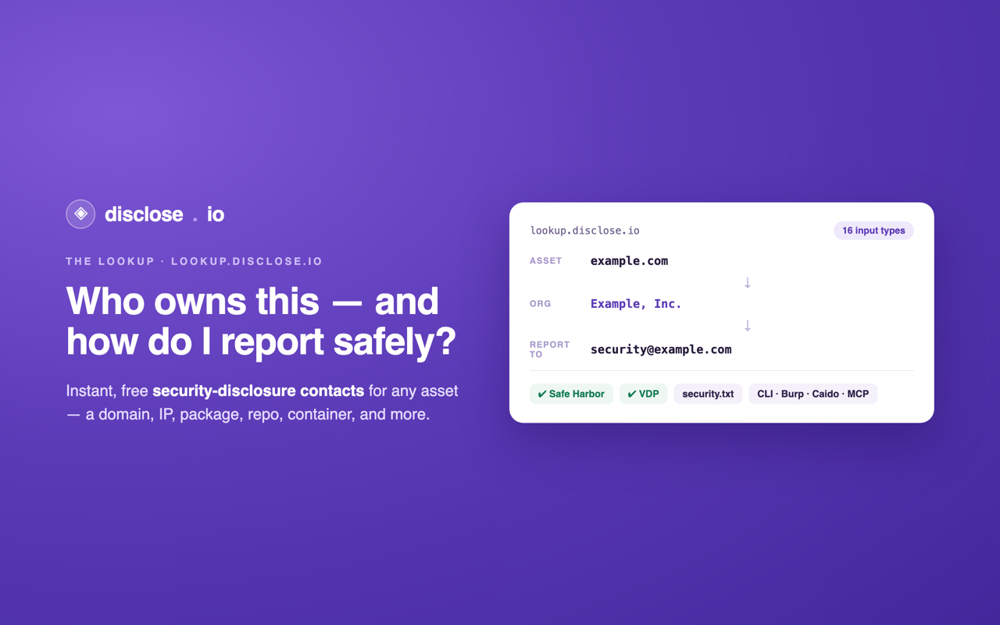

<div align="center">

<a href="https://disclose.io"></a>

# burp-lookup

### Look up a host's **security-disclosure contact** — right inside Burp Suite. Powered by [lookup.disclose.io](https://lookup.disclose.io).

<p>
<a href="LICENSE"></a>
<a href="https://lookup.disclose.io"></a>

<a href="https://github.com/disclose/burp-lookup/issues"></a>
</p>

*Part of **[the disclose.io Project](https://disclose.io)** — the open, vendor-neutral infrastructure for vulnerability disclosure. [Browse the ecosystem →](https://github.com/disclose)*

</div>

---


# Disclosure Contact Lookup — Burp Suite extension

A [Burp Suite](https://portswigger.net/burp) extension that finds the **security-disclosure contact** for any host you're testing, using the free [lookup.disclose.io](https://lookup.disclose.io) attribution API.

Right-click a request (or a host in the site map), choose **"Find disclosure contact"**, and the extension resolves the host to its owning organization and a ranked list of disclosure channels — `security.txt`, VDP / bug-bounty programs, PSIRT directories, and convention emails — so you know exactly where to report what you found.

Built on the modern **Montoya API** (Java).

---

## What it does

- Adds a **"Find disclosure contact"** context-menu item on any request/response (Proxy, Target, Logger, Repeater, …).
- Calls `POST https://lookup.disclose.io/api/lookup` with the host and renders the result in a dedicated **Disclosure Lookup** suite tab:
  - **Attribution** — owning organization, parent company, jurisdiction, confidence.
  - **Ranked contacts** — verified channels first, then by confidence (type, value, label, source).
- Keeps an **activity log** of every lookup (also mirrored to Burp's extension output).

## Privacy

The extension sends **only the host string** (e.g. `github.com`) to lookup.disclose.io. It never transmits the request line, headers, cookies, parameters, or body of your selected HTTP message. The API is free, CORS-open, and requires no authentication. *(BApp Store Submission Criterion 8 — minimal outbound data.)*

A short in-memory cache (5 min TTL) and a 15-second request timeout keep it from spamming the API and from hanging the UI when offline.

---

## Build

This project builds a self-contained (fat) jar with the Gradle [Shadow](https://github.com/GradleUp/shadow) plugin. `montoya-api` is `compileOnly` because Burp provides it at runtime; Gson is shaded into the jar because Burp does not.

**Easiest:** download `burp-lookup-1.0.0.jar` from the [latest release](https://github.com/disclose/burp-lookup/releases/latest) — no toolchain needed.

**Build it yourself** (requires a JDK 17+ and [Gradle](https://gradle.org/install/) 8.x):

```sh
gradle shadowJar
```

The jar is written to `build/libs/burp-lookup-1.0.0.jar`. CI builds and publishes this jar on every push.

## Install in Burp

1. Download `burp-lookup-1.0.0.jar` from the [latest release](https://github.com/disclose/burp-lookup/releases/latest) (or build it above).
2. In Burp: **Extensions → Installed → Add**.
3. Extension type: **Java**.
4. Select `build/libs/burp-lookup-1.0.0.jar`.
5. A **Disclosure Lookup** tab appears. You're ready.

## Usage

1. Anywhere you have an HTTP request — Proxy history, Target site map, Repeater, Logger — **right-click**.
2. Choose **"Find disclosure contact (`<host>`)"**.
3. Switch to the **Disclosure Lookup** tab to see the attribution and ranked contacts.

---

## Development

```
src/main/java/io/disclose/burplookup/
  LookupExtension.java           # BurpExtension entry point (initialize)
  LookupContextMenuProvider.java # ContextMenuItemsProvider — adds the menu item
  LookupClient.java              # java.net.http.HttpClient call + cache + timeout
  LookupResult.java              # typed view of the API response (Gson)
  ResultsTab.java                # the suite tab (attribution header + contacts table + log)
  LookupException.java           # UI-safe lookup failure
```

The network call runs on a background daemon thread (never the Swing EDT); all UI updates are marshalled back onto the EDT via `SwingUtilities.invokeLater`.

CI (`.github/workflows/build.yml`) builds the fat jar on every push and uploads it as an artifact.

## License

[MIT](LICENSE) © disclose.io
